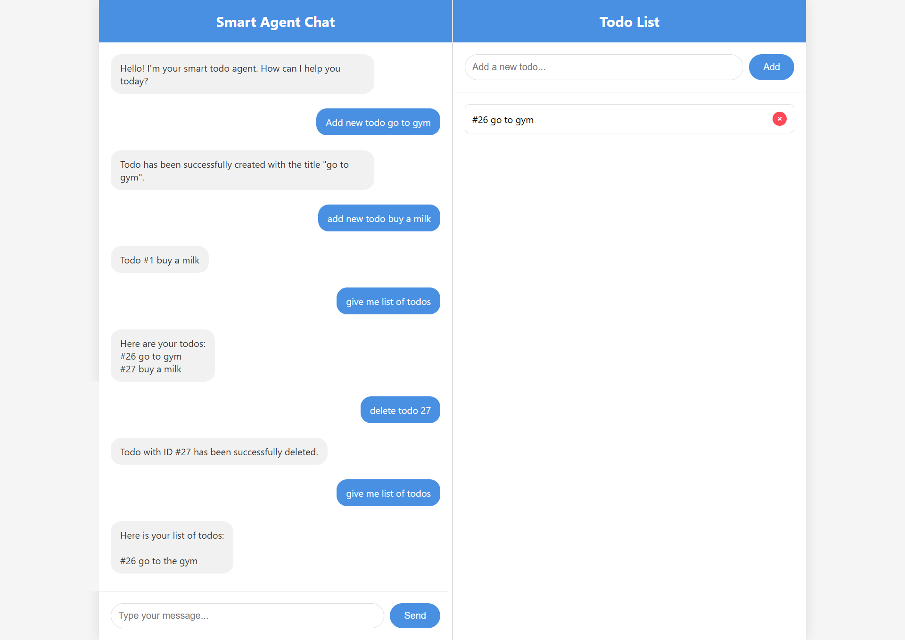

# AI-Powered Todo Application



This is a simple todo application that uses OpenAI's function calling feature to manage todos with natural language.

## About the Project

This project is a Node.js Express application that provides a web interface for managing a todo list. It has two ways of interacting with the todo list:

1.  **A standard REST API:** You can use a GUI Client or `cURL` to perform `CRUD` (Create, Read, Update, Delete) operations on the todos.
2.  **A "smart agent":** You can send natural language commands to an endpoint, and it will use `OpenAI's` language model to understand your intent and perform the corresponding action.

## Getting Started

To get a local copy up and running, follow these simple steps.

### Prerequisites

You need to have Node.js and npm installed on your machine.

*   npm
    ```sh
    npm install npm@latest -g
    ```

### Installation

1.  Clone the repo
    ```sh
    git clone https://github.com/your_username/ai-powered-todos.git
    ```
2.  Install NPM packages
    ```sh
    npm install
    ```
3.  Create a `.env` file in the root of the project and add your `OpenAI API key`:
    ```
    OPENAI_API_KEY=your_openai_api_key
    ```
4.  Start the application:
    ```sh
    npm start
    ```
    Or for development with automatic restarting:
    ```sh
    npm run dev
    ```
The application will be running at `http://localhost:3000`.

## Usage

You can interact with the application through its web interface, the REST API, or the smart agent.

### API Endpoints

The following REST API endpoints are available:

*   `GET /api/todos`: Get all todo items.
*   `POST /api/todos`: Create a new todo item.
    *   **Body:** `{ "title": "Your todo title" }`
*   `DELETE /api/todos/:id`: Delete a todo item by its ID.

### Smart Agent

The smart agent allows you to manage your todos using natural language. Send a POST request to the `/smart-agent` endpoint with a JSON body containing your command.

*   **Endpoint:** `POST /smart-agent`
*   **Body:** `{ "message": "Your natural language command" }`

**Example Commands:**

*   `"Add a new todo to buy milk"`
*   `"What are my todos?"`
*   `"Delete the todo with id 1"`

## Environment Variables

*   `OPENAI_API_KEY`: Your API key for the OpenAI API.

## Built With

*   [Node.js](https://nodejs.org/)
*   [Express](https://expressjs.com/)
*   [Sequelize](https://sequelize.org/)
*   [SQLite](https://www.sqlite.org/)
*   [OpenAI](https://openai.com/)
*   [EJS](https://ejs.co/)

## License

This project is licensed under the MIT License - see the [LICENSE](LICENSE) file for details.
